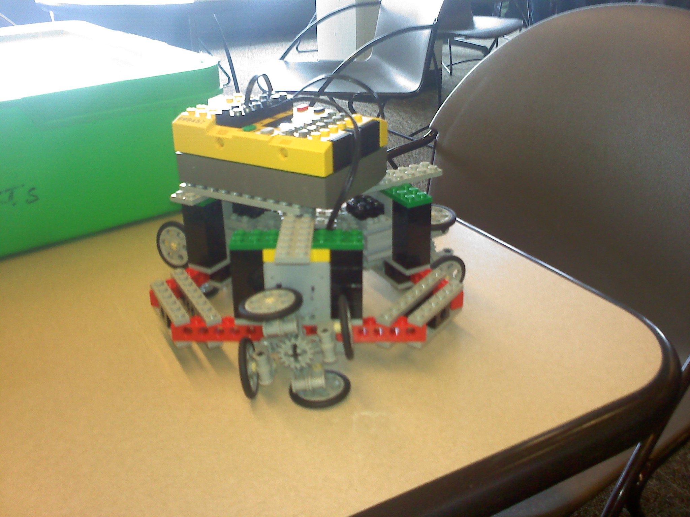
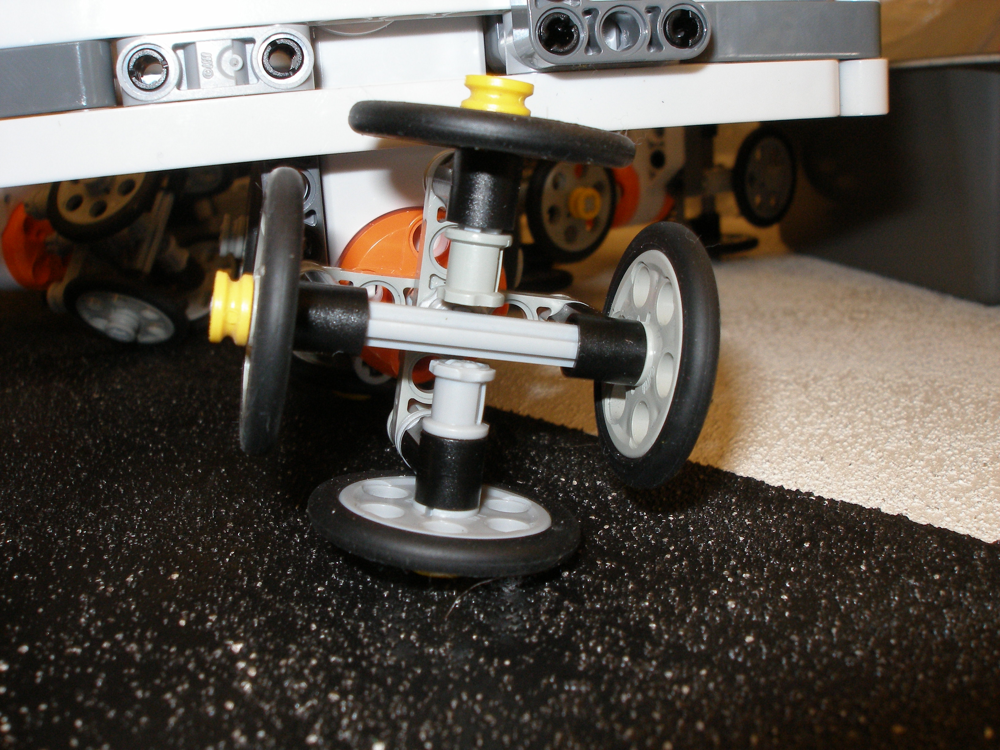
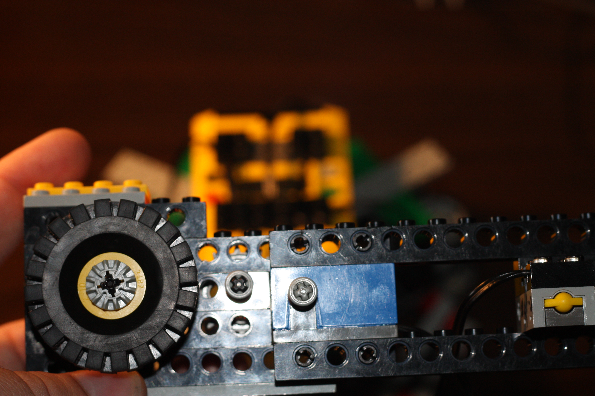

RCX-Omni
========
An omidirectional robot programmed using NQC.
* The associated code may be found under the [repository site](https://github.com/BrickBot/nqc/tree/master/docs/examples/KickerBot).
* It works around RCX limitations primarily using a lookup table for trig, as RCX 1.0 did not support trig or floats.

Design
------
To replicate the hardware setup, see the images Robot.jpg, Wheel.jpg, and Remote.jpg below. Details:
* Three motor outputs on an equilateral triangle frame (see Robot.jpg).
* Each motor output should have an omniwheel or Lego Omniwheel. My design for this wheel is shown in Wheel.jpg
* Robot is controlled with a rotation sensor on Sensor 1, a “reset bearing” button on sensor 2, and a “go” button on sensor 3
* Which output goes to which motor is undocumented…

Images
------

&nbsp;

- - -

[Original Website](https://github.com/rdbahm/RCX-Omni).
* For CSCI 172 at Western Washington University in Spring quarter of 2010
* Written 3-10-2010 and Released to Public Domain 3-13-2014 under the Unlicense
